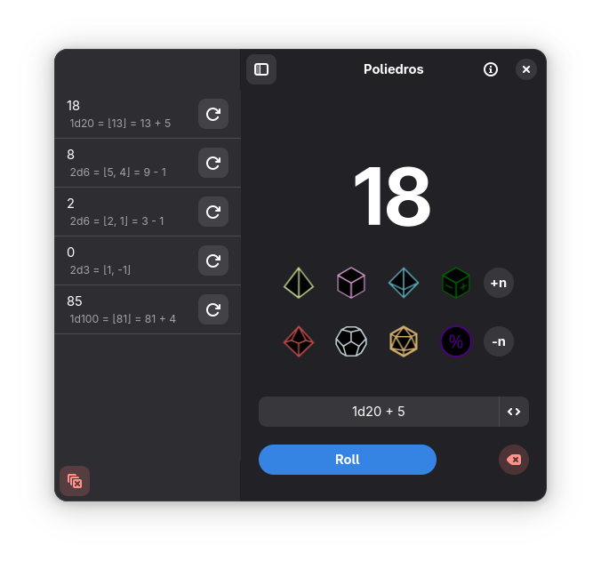

# Poliedros

Poliedros is a multi-type dice roller. Standard mode allows you to make quick rolls using just the mouse, while command mode allows for more complex rolls and combinations.

## Installation

Poliedros is made possible by Flatpak. Only Flathub version is supported.

### Structure

Poliedros is being built using Flatpak, Python, GTK4 and libadwaita, in addition to trying to respect [GNOME HIG](https://developer.gnome.org/hig/).

To build this project just clone this repository using Gnome Builder or VScode with the Flatpak plugin.

### Contributions

I'm an amateur programmer, this is my second real project with GTK4. I'm still learning about the technologies being used in it and many of the solutions used are suboptimal. That said, contributions are welcome.