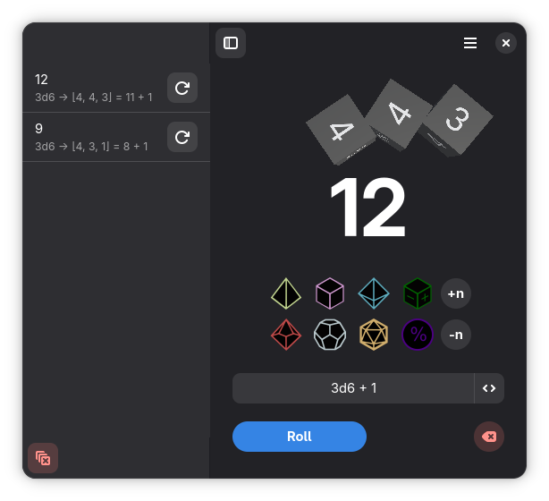

  

<h1 align="center">Poliedros</h1>

  Modern Dice Roller for Linux

  
  
  
  
  
  

Poliedros is a dice roller for tabletop RPGs and board games. It combines a simple interface for quick rolls with a powerful expression language capable of handling advanced dice mechanics used by many game systems.

Poliedros includes a real-time 3D dice roller.

* Fully rendered 3D dice physics.
* Dice rolling sound effects.
* 3D rendering and audio effects can be disabled.

  

## Features

### Basic Mode

Designed for quick rolls.

* Roll standard polyhedral dice (d4 to d20).
* Roll d100.
* Support for Fudge/Fate dice.
* Add and subtract modifiers from the final result.

### Advanced Mode

For complete control over the rolls.

* Roll non-standard dice such as d17, d37, or any number of faces.
* Perform operations between dice pools.
* Chain multiple functions together in a single expression.
* Build complex roll expressions.

#### Supported Functions

* Count - Counts dice matching different conditions.
* Keep - Keeps only selected dice from a roll.
* Reroll - Rerolls and replace dice matching specific conditions.
* Explode - Rerolls and add dice matching specific conditions.
* Multiroll - Executes the same dice expression multiple times and displays every individual result.

## Installation

Poliedros is made possible by Flatpak. Only Flathub version is supported.

## Technology

Poliedros is built with:

* Python.
* GTK 4.
* libadwaita.
* Flatpak.

The project follows the GNOME Human Interface Guidelines whenever possible to provide a native desktop experience.

## Building

### Building with GNOME Builder

GNOME Builder automatically handling Flatpak SDKs, dependencies, and running the application inside a development sandbox.

1) Install GNOME Builder.
2) Clone the repository (or use Builder's built-in clone feature).
3) Open GNOME Builder.
4) Select Open Project and choose the cloned repository.

### Building with Visual Studio Code

Visual Studio Code can also be used together with the Flatpak extension.

1) Install Visual Studio Code.
2) Install the Flatpak extension.
3) Clone the repository.
4) Open the project folder in VS Code.

## Contributions

Contributions, bug reports, help with translations, feature requests, and pull requests are always welcome.